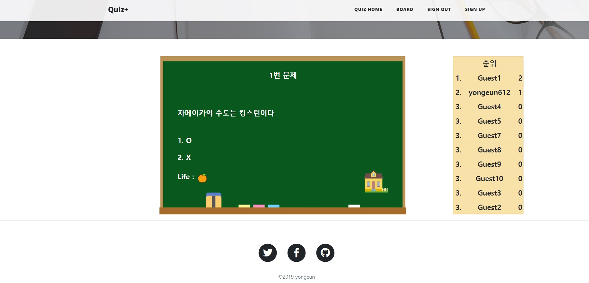

### 프로젝트

## [퀴즈 커뮤니티 웹](https://github.com/yongeun612/yongeun.git)
19.04.18 ~ 19.05.29 Spring 학습을 목적으로 진행한 개인 프로젝트입니다.

### 사용한 기술
- `Java`,`HTML`,`CSS`,`Javascript`
- `Oracle DB`
- `Apache`,`Tomcat`
- `Spring`, `Bootstrap`

### 구현 기능

- 로그인/회원가입

  - DB회원정보
    - 이름
    - 이메일
    - 아이디
    - 비밀번호
    
  - 회원가입
    - 아이디 중복체크
    - 미입력 방지
    - 비밀번호 확인
    
  - 로그인
    - 로그인 성공시 해당 아이디 세션값 생성
    
  - 로그아웃
    - 세션값 삭제
    
- 자유게시판

  - DB 게시판
    - 제목
    - 내용
    - 작성자
    - 날짜
    - 조회수
    
  - 게시글
    - 게시글 목록 돌아가기
    - 게시글 수정
    - 게시글 삭제
  - 게시글 작성(비회원일 경우 비 활성화)
  - 게시글 목록 조회(페이징 및 검색)
  
- 퀴즈

  - DB 선택형퀴즈
    - 문제
    - 정답
    - 보기1
    - 보기2
    - 보기3
    - 보기4
    
  - DB OX형퀴즈
    - 문제
    - 정답
    
  - DB 순위
    - 아이디
    - 선택형퀴즈점수
    - OX퀴즈점수
  
  - 선택형 퀴즈
    - 정답시 다음 문제 이동
    - 3회 오답시 메인페이지 이동
    - 퀴즈 메인페이지 돌아가기
    - 현재 순위
    
  - OX형 퀴즈
    - 정답시 다음 문제 이동
    - 1회 오답시 메인페이지 이동
    - 퀴즈 메인페이지 돌아가기
    - 현재 순위
  
  - 퀴즈관리(관리자 계정)  
      - 선택형퀴즈 리스트
        - 퀴즈 수정
        - 퀴즈 삭제
      
      - OX퀴즈 리스트
        - 퀴즈 수정
        - 퀴즈 삭제
    
### 느낀점 및 추가해야할 것
  - 오류가 없는데 동작이 안되면 재부팅이 답! (~~30분 동안 허탕..~~)
  - 모바일 환경에서는 일부 찌그러지거나 안보이는 부분과 UI 개선
  - API와 웹 애니메이션 기능 등을 사용하여 다양한 콘텐츠 추가
  

#### 스크린샷

 

